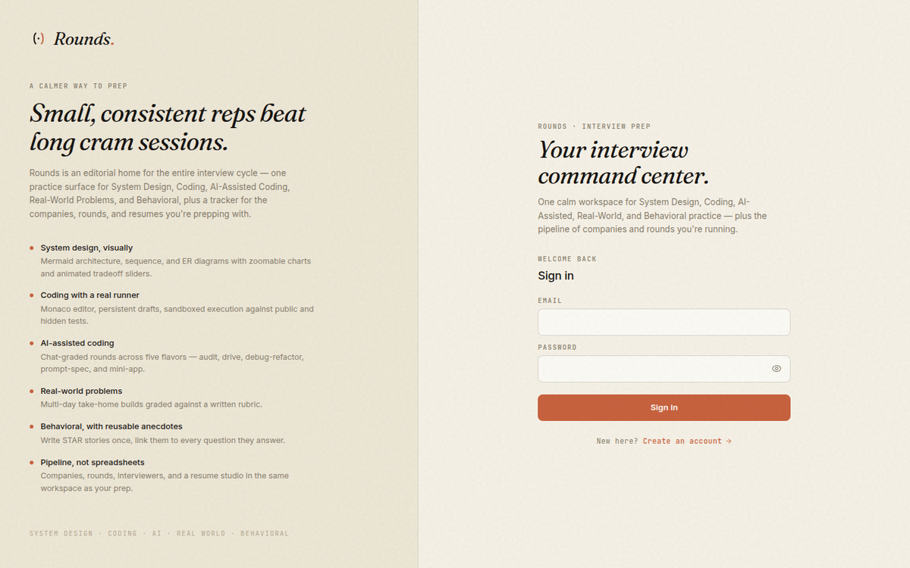
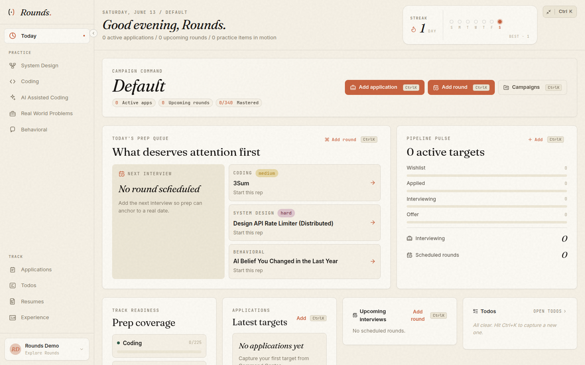
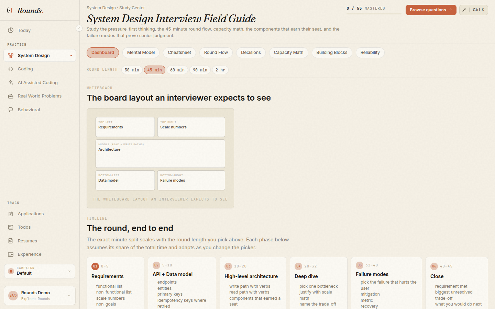
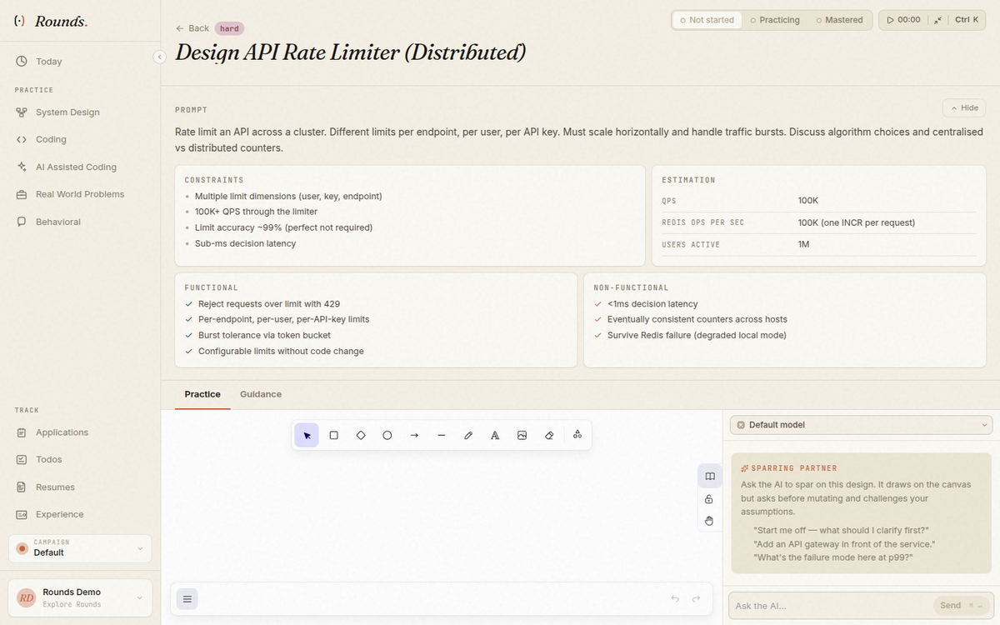
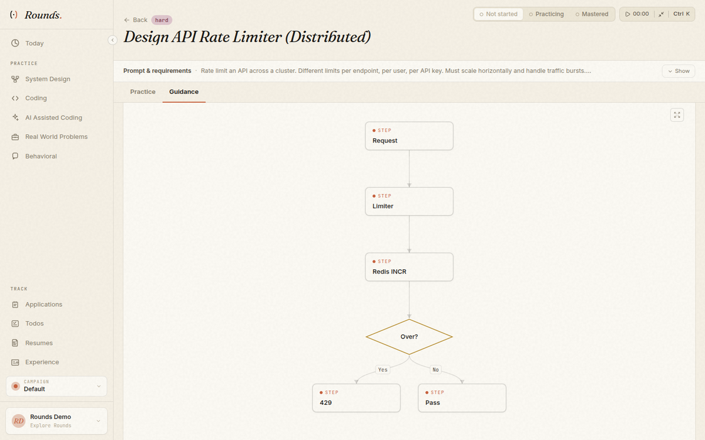
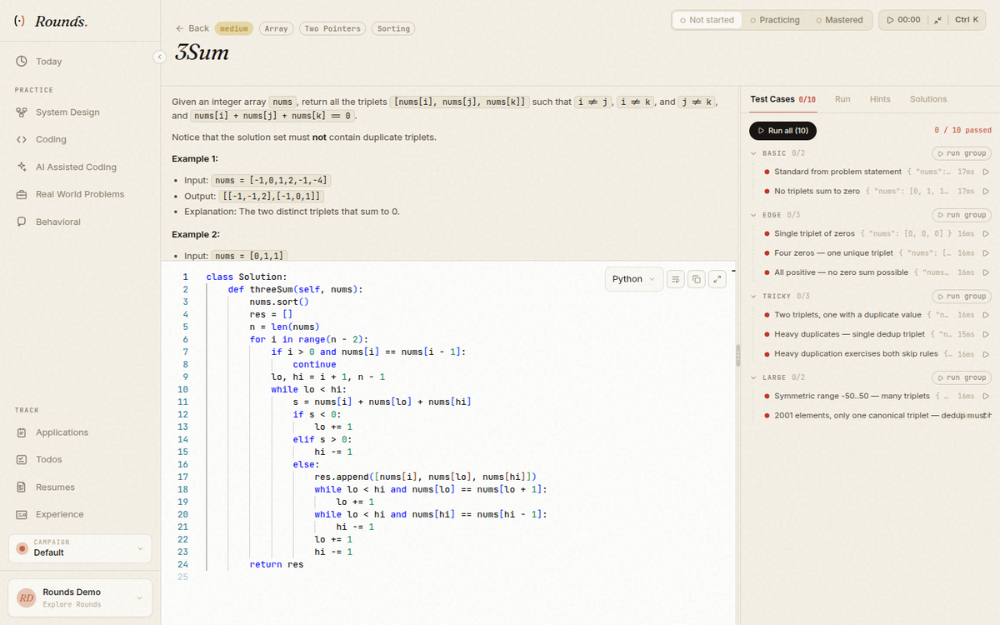
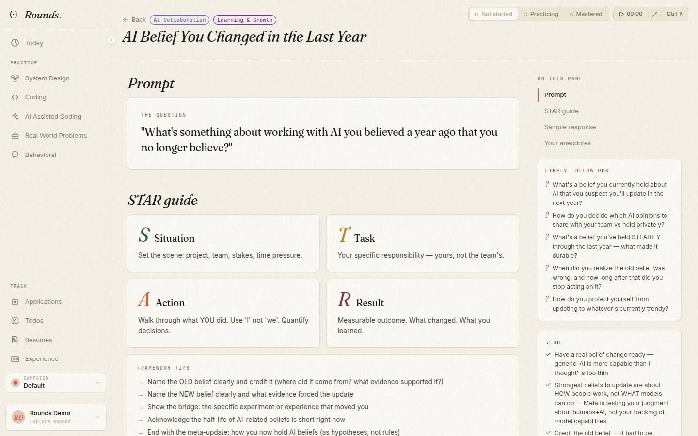
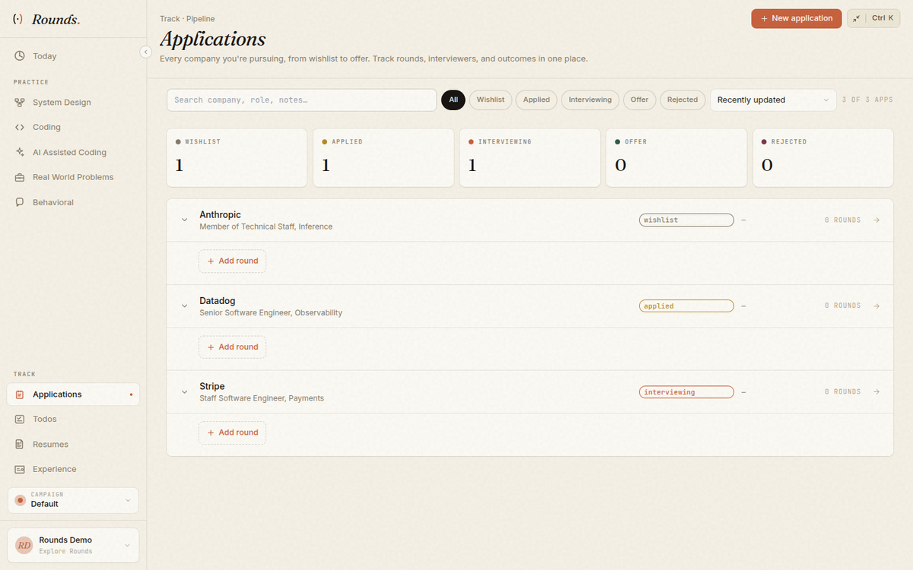
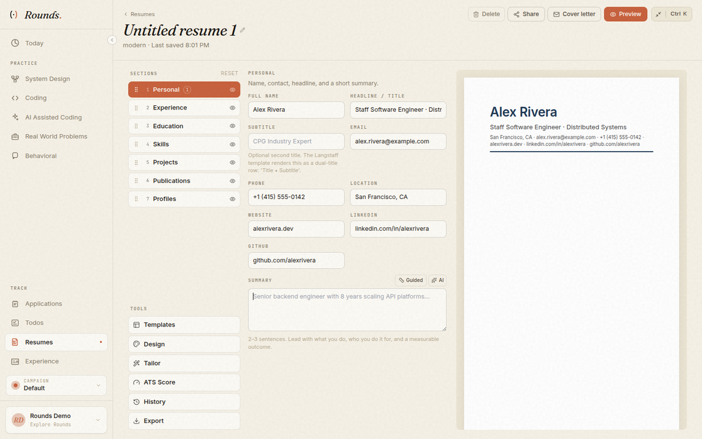
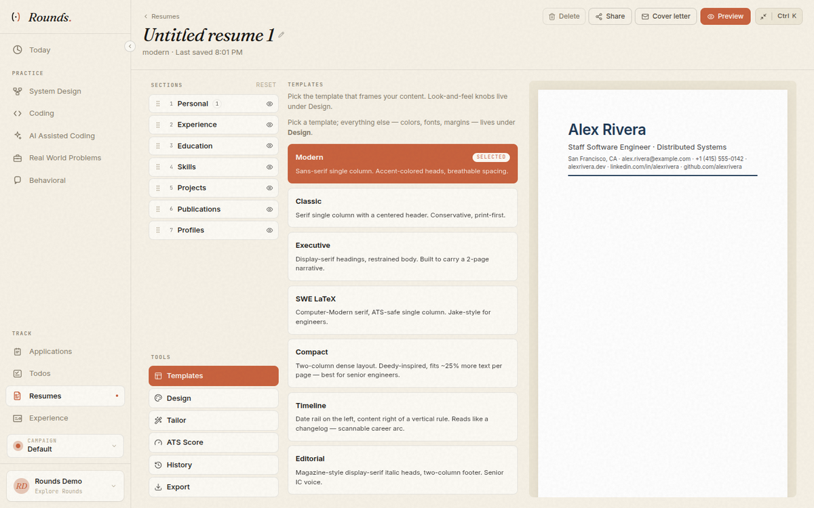

# 🎯 Rounds — Visual Showcase

A tour of Rounds, the self-hostable interview-prep command center: one calm, editorial workspace for **System Design**, **Coding**, **AI-Assisted Coding**, **Real-World Problems**, and **Behavioral** practice — plus a pipeline tracker for companies, rounds, and resumes.

> _Screenshots captured from a local development build using the seeded demo account. Application and resume data shown is illustrative._

---

## 🔐 Sign In

An editorial landing that doubles as the sign-in surface, summarizing the five practice tracks and the application pipeline.

---

## 🏠 Dashboard — Today

Your daily command center: streak tracking, campaign command, today's prep queue, prep coverage, and live targets across every active application.

---

## 🏛️ System Design

### Study center
A field guide covering pressure-first thinking, round flow, capacity math, components that earn their seat, and senior-level failure modes.

### Per-question practice
Each question pairs a prompt, constraints, and requirements with a timer, status tracking (Not started → Practicing → Mastered), and a notes scratchpad.

### System design, visually
Guidance ships zoomable **Mermaid** architecture, sequence, and ER diagrams alongside trade-off panels and senior follow-up topics.

---

## 💻 Coding

A full **Monaco** editor with persistent drafts, focus mode, and a sandboxed runner that executes your solution against public and hidden test cases — here, a 3Sum solution passing the full suite.

---

## 🗣️ Behavioral

Competency-tagged questions with STAR-story guidance, reusable personal anecdotes, and question-to-story linking.

---

## 📊 Applications — Pipeline

Track every company from wishlist to offer, with statuses, rounds, interviewers, campaign context, and todos — all in the same workspace as your prep.

---

## 📄 Resume Studio

Four templates, per-section editors with drag-and-drop reordering, a live document preview, JD-aware tailoring, ATS scoring, version history, AI bullet rewrites, server-rendered PDFs, and exports to DOCX / HTML / Markdown / plain text / JSON Resume — plus public share links.

### Section editor + live preview

### Template gallery

---

## ✨ At a Glance

| Track / Area | Highlights |
|--------------|------------|
| **System Design** | Mermaid diagrams · trade-off sliders · cheat-sheet guides · senior follow-ups |
| **Coding** | Monaco editor · persistent drafts · sandboxed runner · public + hidden tests |
| **AI-Assisted Coding** | Multi-file workspace · AI chat (Ask mode) · per-checkpoint test runner · rubric grading |
| **Real-World Problems** | Multi-day take-home builds graded against a written rubric |
| **Behavioral** | STAR stories · competency tags · reusable anecdotes |
| **Applications** | Wishlist → Offer pipeline · rounds · interviewers · campaigns · todos |
| **Resume Studio** | 4 templates · ATS scoring · JD tailoring · PDF/DOCX/MD export · share links |
| **Stack** | React 18 + Vite + Tailwind · PocketBase + SQLite · FastAPI runner · Docker/K8s |

---

_See the [README](README.md) for setup, deployment, and configuration._
